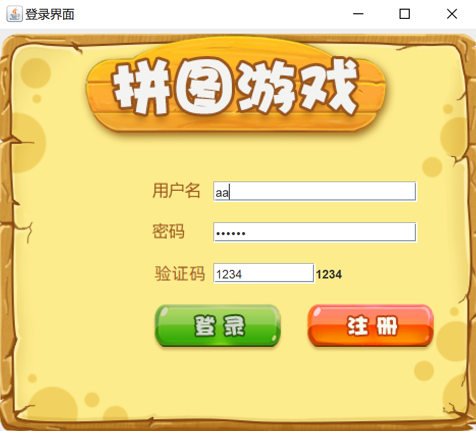
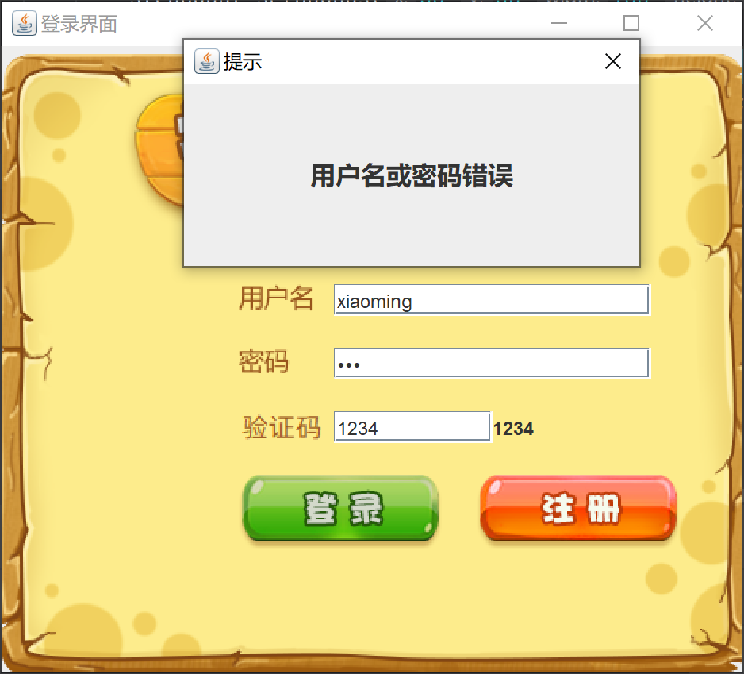

# ✔项目简介-🐶

这是一个😮‍💨的数字华容道，或者叫做15 puzzle、数字滑块拼图的项目，是比较常见的一款经典拼图游戏。

## 项目结构

- `src/com/lsd/ui/GameJFrame.java`：游戏主界面
- `src/com/lsd/ui/LoginJFrame.java`：登录界面
- `src/com/lsd/ui/RegisterJFrame.java`：注册界面
- `image/`：图片资源

## 项目截图

  
  

 
    
  

## **git-记录**

1,界面搭建，菜单搭建，主界面，登录注册界面v1.0
next：主界面添加图片，加图片素材

1,主界面添加图片，取消隐藏容器居中，细节，可让存放图片的容器，根据x，y布局图片
next：打乱图片，二维数字

1,打乱图片，通过二维数组来存储，打乱的一维数组，添加test类
next：事件，组件能对鼠标，键盘的识别操作

1,事件动作监听，按钮，
way1按钮添加动作事件，实现监听接口重写
way2按钮添加，使用匿名内部类
way3窗口实现监听接口，按钮传递本类的对象，重写接口的方法
next：事件，组件能对鼠标，键盘的识别操作

1,事件，组件能对鼠标，键盘的识别操作
next:作弊码，美化界面

1,美化界面,注意相对路径
next：移动图片

1,fix主界面大小+阶段截图
查看完整图片，作弊码，判断胜利

1,记步，菜单栏

登录功能，控件数据获取和静态数据对比
next:注册，验证码，排位

简易验证码
都只创建一个子窗口实例
next:修改bug

按w后不能按a显示全图，改字体样式

v2.0.0大更新：模拟人工打乱data，确保有解
新添加游戏教程

v2.0.1更新：数据保存到本地，使用gson库，save，load函数，保存，加载json文件

待做📚
next：排位，显示游玩时间等
---
- [x] 完成移动图片功能
- [x] 实现计步数
- [x] 添加快捷键，作弊码
- [x] 更换图片种类
- [x] 完成登录注册功能
- [x] 完成打乱图片逻辑
- [ ] 添加排行榜
      
## 📅 开发日志
- 🗓️ 2025-06-13：主页面模拟打乱，确保移动有解。
- 🗓️ 2025-06-06：完善其他页面。
- 🗓️ 2025-06-05：创建项目上传GitHub。
- 🗓️ 2025-06-05：实现主要功能。
- 🗓️ 2025-06-05：看视频。

## ❌常见问题

 图片没有显示？

 ### 请确保代码中图片路径没有错误，是相对于项目根目录的。

 出现两个空格？

 ### 请确保打乱数组时，记录0的位置后新的二维数组也需要重新赋值，不能跳过。

