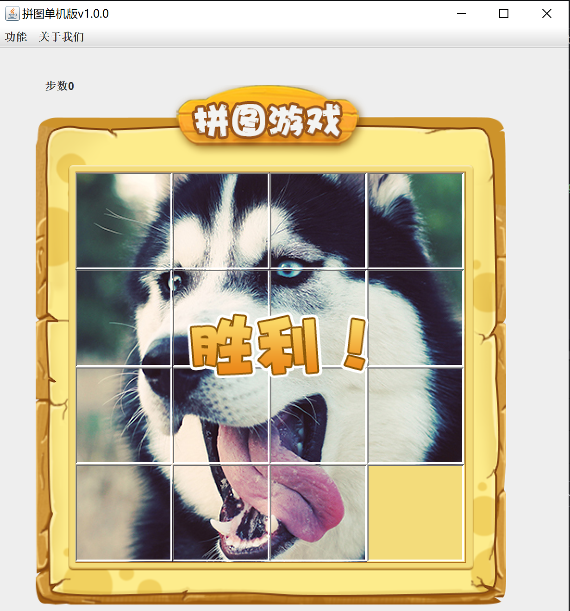

# 个人练习-🐱

这是一个简单的拼图游戏。

## 项目结构

- `src/`：源代码
- `image/`：图片资源

## 截图

### **git-记录**

1,界面搭建，菜单搭建，主界面，登录注册界面v1.0
next：主界面添加图片，加图片素材

1,主界面添加图片，取消隐藏容器居中，细节，可让存放图片的容器，根据x，y布局图片
next：打乱图片，二维数字

1,打乱图片，通过二维数组来存储，打乱的一维数组，添加test类
next：事件，组件能对鼠标，键盘的识别操作

1,事件动作监听，按钮，
way1按钮添加动作事件，实现监听接口重写
way2按钮添加，使用匿名内部类
way3窗口实现监听接口，按钮传递本类的对象，重写接口的方法
next：事件，组件能对鼠标，键盘的识别操作

1,事件，组件能对鼠标，键盘的识别操作
next:作弊码，美化界面

1,美化界面,注意相对路径
next：移动图片

1,fix主界面大小+阶段截图
查看完整图片，作弊码，判断胜利

~~1,记步，菜单栏~~

待做
next：登录界面，业务分析，更换图片种类，栏目等
---
- [x] 完成移动图片功能
- [x] 实现计步数
- [x] 添加快捷键，作弊码
- [ ] 完成登录功能
- [ ] 更换图片种类
- [ ] 添加排行榜
      
## 📅 开发日志

- 🗓️ 2025-06-06：创建项目上传GitHub。
- 🗓️ 2025-06-05：实现主要功能。
- 🗓️ 2025-06-05：看视频。

